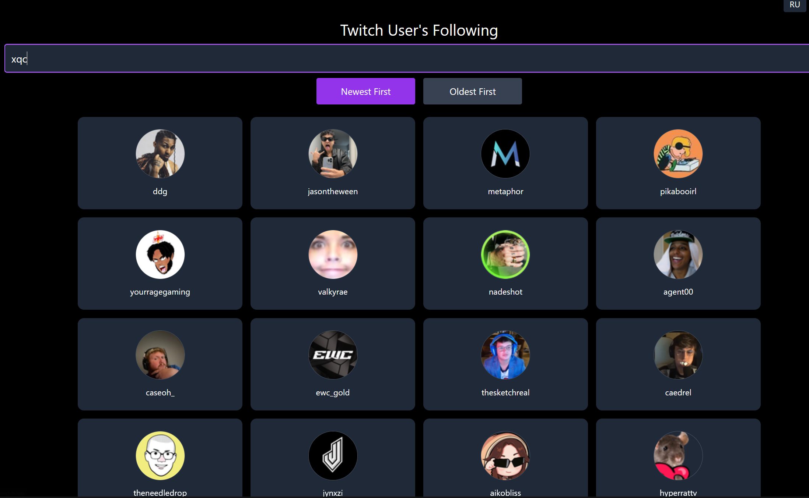

# Twitch Following

⚠️ **This version is deprecated. A new and improved version is available here: [twitch-following-v2](https://burryfun.github.io/twitch-following-v2)** ⚠️

A minimal and responsive web app that allows you to view the channels a Twitch user is following.

## Live Demo

[View it on GitHub Pages](https://burryfun.github.io/twitch-following/)

## How to Use

- Enter a Twitch username (e.g. `xqc`)
- Press Enter or click a sort button
